# KubeSphere Console 前端插件系统技术调研（2026）

> **设计定位**
>
> - 核心理念：**Everything is Plugin**
> - 自研 Runtime Kernel，不直接采用 Cordis
> - 参考 **Spatiotemporal Composability（时空可组合）** 的核心思想
> - 使用 `Revertible Effect + Reactive Coeffect + Context + Fiber` 作为底层模型
> - Module Federation / ESM / iframe 仅作为 **Artifact Loader** 的实现
> - Builtin Plugin 与 External Plugin 尽量共享同一套核心协议和生命周期
>
> **版本**：Draft v0.2  
> **日期**：2026-09-01  
> **适用范围**：KubeSphere / KSE Console 新一代前端插件平台

---

## 目录

- [0. 执行摘要](#0-执行摘要)
- [1. 设计目标与非目标](#1-设计目标与非目标)
- [2. 理论基础：时空可组合，但不绑定 Cordis](#2-理论基础时空可组合但不绑定-cordis)
- [3. 总体架构](#3-总体架构)
- [4. 核心运行时模型](#4-核心运行时模型)
- [5. Service / Capability 与 Reactive Coeffect](#5-service--capability-与-reactive-coeffect)
- [6. Plugin Definition 与 API 形态](#6-plugin-definition-与-api-形态)
- [7. Extension System](#7-extension-system)
- [8. React 集成层](#8-react-集成层)
- [9. KS Console 自身插件化](#9-ks-console-自身插件化)
- [10. Artifact Loader：把 Module Federation 降级为实现细节](#10-artifact-loader把-module-federation-降级为实现细节)
- [11. Plugin Manifest](#11-plugin-manifest)
- [12. 信任与安全边界](#12-信任与安全边界)
- [13. 插件开发体验](#13-插件开发体验)
- [14. 发布、版本、升级与回滚](#14-发布版本升级与回滚)
- [15. Runtime 诊断与可观测性](#15-runtime-诊断与可观测性)
- [16. 推荐代码结构](#16-推荐代码结构)
- [17. 分步实施规划](#17-分步实施规划)
- [18. 第一版 POC 验收矩阵](#18-第一版-poc-验收矩阵)
- [19. KS Console 渐进迁移策略](#19-ks-console-渐进迁移策略)
- [20. 明确禁止 / 尽量避免的设计](#20-明确禁止--尽量避免的设计)
- [21. 关键架构决策清单](#21-关键架构决策清单)
- [22. 仍需单独决策的问题](#22-仍需单独决策的问题)
- [23. 第一项实际开发任务](#23-第一项实际开发任务)
- [24. 参考资料](#24-参考资料)
- [25. 最终结论](#25-最终结论)

---

# 0. 执行摘要

如果要让 KubeSphere Console 真正做到 **Everything is Plugin**，底层不能只解决“远程 JavaScript 如何加载”，而必须优先解决两个更基础的问题：

1. **插件产生的副作用如何被完整撤销？**
2. **插件依赖的能力在运行时出现 / 消失时，如何自动驱动插件状态变化？**

因此，本方案将系统拆成三层：

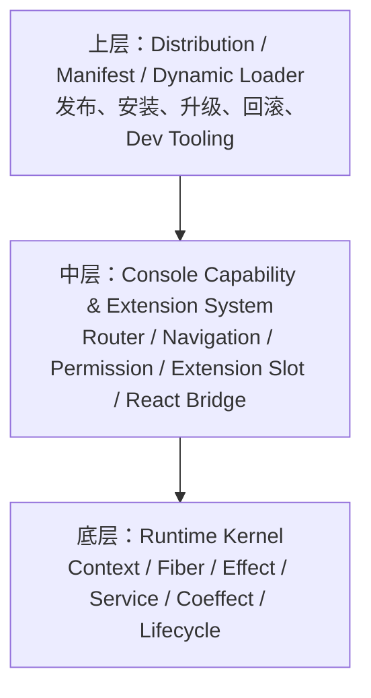

其中：

- **Runtime Kernel** 与 React、Module Federation、KubeSphere 业务无关；
- **浏览器 / React 集成层** 把 Router、Navigation、Theme、Permission、ExtensionSlot 等变成 Plugin 能力；
- **动态加载层** 才处理 Manifest、ESM、Module Federation、发布和版本。

> **一句话架构**
>
> Plugin 在 `Context` 上声明 **Coeffect（我需要什么）**，并产生可归属、可撤销的 **Effect（我改变什么）**；  
> `Fiber` 负责插件实例的生命周期与 Effect 所有权；  
> Runtime 根据 Context 变化，自动协调插件在 `PENDING / ACTIVE` 等状态之间转换。

| 问题 | 传统做法 | 本方案 |
|---|---|---|
| 插件加载顺序 | 启动时 DAG / 手工 priority | Requirements 不满足时 PENDING；满足后自动激活 |
| 插件卸载 | 手写 `unregister / cleanup` | Effect 归属 Fiber，统一 LIFO dispose |
| 插件依赖插件 | 直接依赖 plugin name | 优先依赖 Capability / Service |
| 扩展点 | Host 固定 import / 主动拉插件 | Extension Service + Effect，贡献与消费解耦 |
| 动态加载 | `remoteEntry` 就是插件协议 | Loader abstraction，MF / ESM / iframe 可替换 |
| KS Console 自身 | Host 是特殊主体 | 除最小 Kernel 外均可 builtin plugin |

---

# 1. 设计目标与非目标

## 1.1 目标

本系统希望达到：

- KS Console 自身由一组 **builtin plugins** 组成；
- Builtin Plugin 与 External Plugin 尽量使用同一套核心 API；
- 插件可以动态安装、启用、停用、升级、回滚；
- 运行时插件变化原则上不要求整页重启；
- 插件之间尽量通过 **Capability / Service** 与 **Extension Point** 解耦；
- 插件不应直接 import 另一个插件的内部 store / hook / implementation；
- 每个副作用都有明确 owner；
- 插件卸载或激活失败后，系统可以恢复到插件介入前的状态；
- Required capability 可以在运行时动态出现和消失；
- Runtime 自动处理 `PENDING / ACTIVE`；
- Kernel 不依赖 React、Module Federation、具体 Router 或 KS 业务；
- 支持 builtin、trusted external、generated plugin；
- 为未来不可信插件预留 sandbox iframe；
- 插件日常开发不要求启动完整 KS Console；
- 支持轻量 Dev Host / Mock Context；
- 为 AI 动态生成 Plugin / Dynamic Package / Static Package 保留统一 Runtime 模型。

## 1.2 非目标

第一阶段明确不做：

- 不追求兼容所有前端框架，优先 React Console；
- 不把 Module Federation `shared` dependency 当成跨插件 ABI；
- 不在第一阶段完成不可信第三方插件的完整安全沙箱；
- 不一次性重构现有全部 KS Console；
- 不在 Runtime Kernel 中加入 React / Router / MF；
- 不在第一版预定义几十种 Extension Point；
- 不通过配置文件顺序作为业务加载语义。

---

# 2. 理论基础：时空可组合，但不绑定 Cordis

2026 年的 **A Programming Paradigm for Spatiotemporal Composability** 将动态组合问题拆成两个正交维度：

## 2.1 Temporal Composability

核心问题：

> 一个组件被移除后，它曾经对系统造成的影响能不能完整、安全地撤销？

对应到插件系统：

```text
register route      -> remove route
register menu       -> remove menu
subscribe event     -> unsubscribe
provide service     -> remove provider
register extension  -> remove contribution
mount DOM            -> unmount DOM
start watcher        -> abort watcher
```

本设计将这些变化统一建模为：

```text
Revertible Effect = apply + inverse
```

Effect 的 inverse 由 Runtime 保存，而不是依赖插件作者自己在各种 lifecycle callback 中维护。

---

## 2.2 Spatial Composability

核心问题：

> 一个组件能否只声明“我需要什么”，而不关心这些能力由谁、以什么顺序提供？

例如：

```text
KubeEye requires kubesphere.cluster@2
```

而不是：

```text
KubeEye depends on cluster-plugin
```

当 `kubesphere.cluster`：

- 不存在：KubeEye 为 `PENDING`
- 出现：KubeEye 自动 `ACTIVE`
- 消失：KubeEye 自动撤销 Effects，回到 `PENDING`
- 再出现：KubeEye 自动重新激活

这就是本设计中的：

```text
Reactive Coeffect
```

---

## 2.3 理论概念与本设计映射

| 理论概念 | 本设计中的对应 |
|---|---|
| Revertible Effect | Route、Menu、Event、Service Provider、Extension Contribution 等产生 disposer |
| Reactive Coeffect | `requires / optional requires`；Context 变化触发需求重新判定 |
| Context | Plugin 与 Runtime World 交互的唯一受控入口 |
| Component | Plugin Definition + Fiber + requirements + effects |
| Dynamic Composition | 任意 discovery / mount / unload 顺序，最终由 Context 收敛 |
| Effect Ownership | Fiber / child scope |
| Temporal rollback | Fiber dispose / activation rollback |
| Spatial reaction | Requirement Resolver |

> **关键取舍**
>
> 采用这套**理论模型**，但不直接采用 Cordis 作为产品级框架依赖。  
> 这样可以保留 KubeSphere 自己的 TypeScript 类型体系、错误模型、浏览器适配、生命周期策略与版本兼容模型。

---

# 3. 总体架构

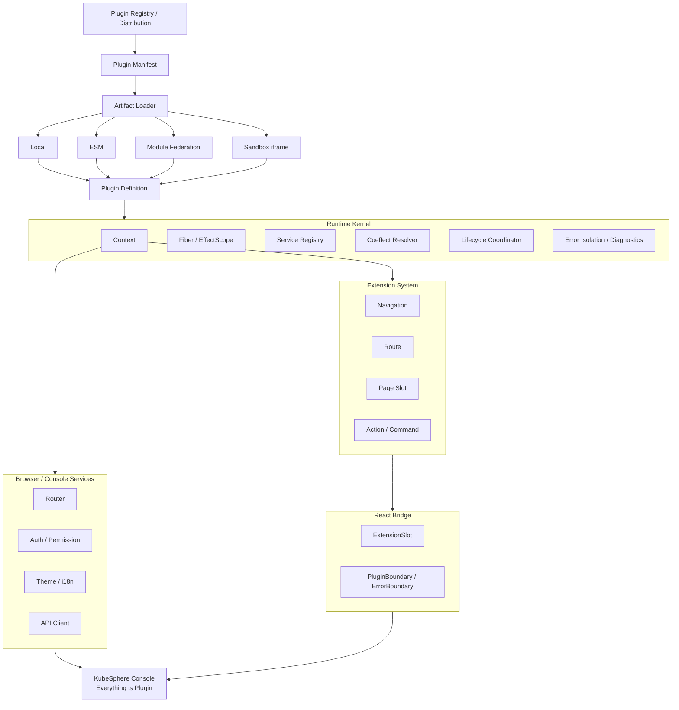

---

## 3.1 最小不可插件化 Kernel

“Everything is Plugin”并不意味着零 bootstrap。

必须保留一个尽可能小的 meta-runtime，否则会遇到：

```text
Plugin Manager 是 Plugin
        ↓
谁来加载 Plugin Manager？
        ↓
另一个 Plugin Manager？
```

Kernel 建议只包含：

- Root Runtime / Root Context
- `EffectScope`
- `Fiber`
- Plugin Registry
- Service Registry / Capability Resolution
- Coeffect / Requirement Resolver
- Lifecycle Coordinator
- Error isolation
- Diagnostics event
- Loader **接口**
- Scope / ownership infrastructure

具体的 MF / ESM Loader 不属于 core。

---

## 3.2 Everything is Plugin 的边界

以下能力原则上都可以做成 builtin plugin：

```text
Router
Layout
Navigation
Theme
Auth
Permission
Cluster
Workspace
Workload
Monitoring
DevOps
Service Mesh
AI
Extension Registry
Command Palette
Settings
```

Kernel 不负责业务意义上的 Console。

Kernel 的职责只有：

> 让这些模块能够安全地组合、停用、恢复、升级与诊断。

---

# 4. 核心运行时模型

## 4.1 EffectScope：第一优先级

真正开始开发时，第一项实现不应该是 `PluginManager`，而是：

```ts
type Disposer = () => void | Promise<void>;

class EffectScope {
  private disposers: Disposer[] = [];
  private children = new Set<EffectScope>();

  add(disposer: Disposer): void {
    // ...
  }

  child(): EffectScope {
    // ...
  }

  async dispose(): Promise<void> {
    // LIFO
    // idempotent
    // child cascade
  }
}
```

`EffectScope` 至少需要解决：

- Effect ownership
- LIFO dispose
- 幂等 dispose
- async disposer
- child scope
- failure aggregation
- activation rollback

---

## 4.2 为什么 Effect 必须 LIFO

假设：

```text
Effect A：创建 Root
Effect B：在 Root 上创建 Child
```

Apply：

```text
A
└── B
```

Dispose 必须：

```text
B⁻¹
A⁻¹
```

而不是：

```text
A⁻¹
B⁻¹
```

用 Mermaid 表示：

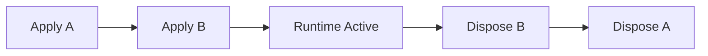

因此 `EffectScope` 天然是一个 stack-like abstraction。

---

## 4.3 Fiber：Plugin Instance 与生命周期所有权

`PluginDefinition` 是静态定义。

`Fiber` 是一次实际挂载后的 Runtime Instance。

```ts
type FiberState =
  | 'created'
  | 'pending'
  | 'activating'
  | 'active'
  | 'disposing'
  | 'disposed'
  | 'failed';

class Fiber extends EffectScope {
  readonly id: string;
  readonly plugin: PluginDefinition;
  readonly context: Context;

  state: FiberState;
}
```

一个 Plugin Definition 可以拥有多个 Fiber：

```text
MonitoringPlugin
├── cluster-a Fiber
├── cluster-b Fiber
└── cluster-c Fiber
```

因此必须明确区分：

```text
Definition != Instance
Plugin != Fiber
```

---

## 4.4 Fiber 状态模型

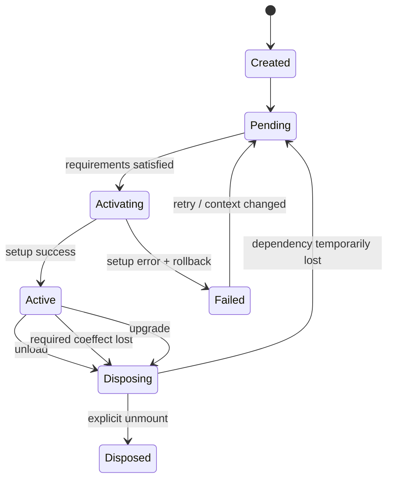

---

## 4.5 Context：插件唯一受控交互入口

插件不应该直接调用：

```ts
globalExtensionRegistry.register(...)
globalRouter.add(...)
window.ks.xxx = ...
```

应该统一经过：

```ts
ctx.services.provide(...)
ctx.extensions.register(...)
ctx.events.on(...)
ctx.router.add(...)
ctx.effect(...)
```

最小 API：

```ts
interface PluginContext {
  readonly services: ServiceView;
  readonly extensions: ExtensionView;
  readonly events: EventView;
  readonly scope: ScopeView;

  effect(
    register: () =>
      | void
      | Disposer
      | Promise<void | Disposer>
  ): void;
}
```

关系：

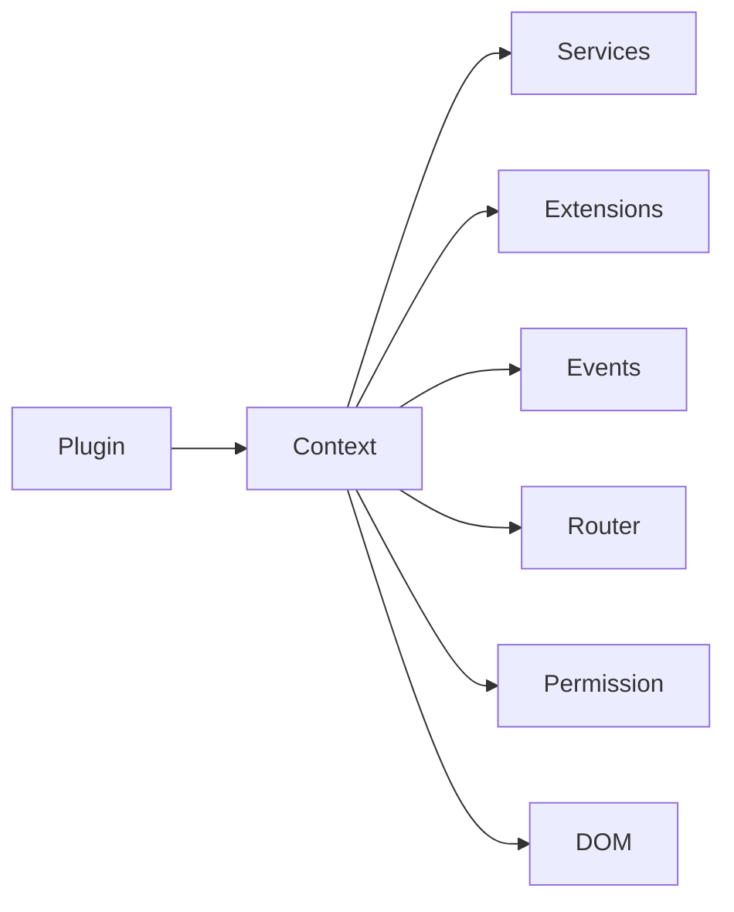

只要 mutation 经过 Context，Runtime 就可以：

- 知道谁创建的；
- 保存 inverse；
- 做 rollback；
- 做 diagnostics；
- 做 scope isolation；
- 对 Context 变化做响应。

---

## 4.6 当前 Fiber 与自动 Effect Ownership

日常 Plugin API 不应要求开发者反复写：

```ts
ctx.effect(...)
```

例如：

```ts
ctx.events.on('cluster.changed', handler);
ctx.extensions.register(...);
ctx.services.provide(...);
ctx.router.add(...);
```

这些 API 内部应自动知道：

```text
Current Fiber = kubeeye#14
```

并把 disposer 加入这个 Fiber。

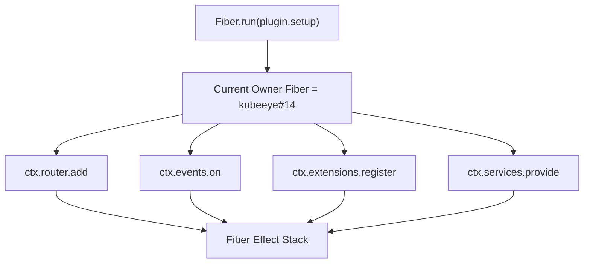

只有 Runtime 无法理解的外部资源才显式：

```ts
ctx.effect(() => {
  const controller = new AbortController();

  startExternalWatcher(controller.signal);

  return () => controller.abort();
});
```

---

## 4.7 Revertible Effect：常见映射

| 操作 | Apply | Inverse |
|---|---|---|
| Route | 注册 `/kubeeye` | 删除对应 route |
| Navigation | 增加导航项 | 删除导航项 |
| Extension | 注册 contribution | 删除 contribution |
| Event | subscribe | unsubscribe |
| Service | provide capability | remove provider |
| DOM | mount root | unmount root |
| CSS | append style | remove style |
| Timer | `setInterval` | `clearInterval` |
| Watcher | start | abort / stop |
| Child Plugin | mount child Fiber | dispose child Fiber |

---

## 4.8 激活失败必须原子 Rollback

例如：

```ts
async function setup(ctx: PluginContext) {
  ctx.router.add(...);
  ctx.extensions.register(...);

  await initialize();

  throw new Error('boom');
}
```

Runtime 应执行：

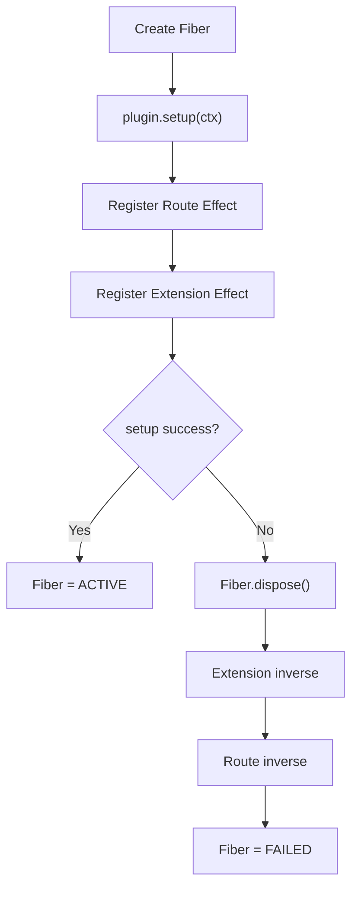

最终应满足：

```text
System State After Failure
≈
System State Before Plugin Activation
```

这是未来以下能力的基础：

- 动态升级
- Rollback
- HMR
- 插件重新加载
- dependency lost / restore
- staged activation

---

## 4.9 Parent / Child Scope

Plugin 内部可以进一步创建 feature scope：

```text
KubeEye Fiber
├── ClusterFeature Scope
│   ├── Tab Effect
│   └── Cluster Watcher
│
└── ExportFeature Scope
    ├── Command Effect
    └── Menu Effect
```

Child scope 适合：

- optional feature
- feature flag
- workspace scope
- cluster scope
- namespace scope
- route scope
- dynamic session
- AI generated submodule

这使得：

```text
optional capability appears/disappears
```

不一定要重启整个 Plugin Fiber，未来可以只重建某个 child scope。

---

# 5. Service / Capability 与 Reactive Coeffect

## 5.1 优先依赖 Capability，而不是 Plugin

不推荐：

```text
KubeEye ──depends──> cluster-plugin
```

推荐：

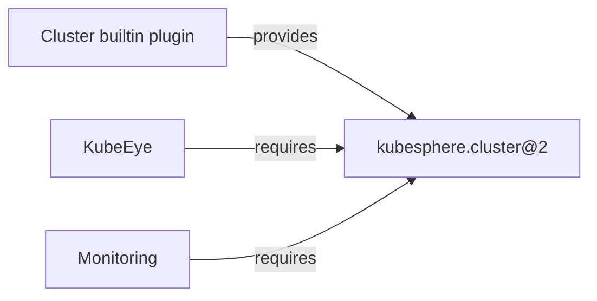

Capability 是稳定 contract。

Provider 是实现。

Consumer 只依赖 contract：

```text
Consumer -> Capability <- Provider
```

而不是：

```text
Consumer -> Provider Implementation
```

---

## 5.2 Service Provider

示例：

```ts
ctx.services.provide(
  'kubesphere.cluster',
  {
    version: '2.1.0',
    value: clusterService,
  },
);
```

`provide()` 本身必须是 Effect：

```text
Cluster Fiber dispose
        ↓
Service Provider inverse
        ↓
kubesphere.cluster disappears
```

因此 Provider 生命周期天然与 owner Fiber 对齐。

---

## 5.3 Requirements 模型

| 类型 | 语义 | 是否阻塞激活 |
|---|---|---:|
| required capability | 缺失时 PENDING；出现后自动激活 | 是 |
| optional capability | 有则增强，无则仍能工作 | 否 |
| hard plugin dependency | 确实依赖指定 Plugin identity 时使用 | 是，尽量少 |
| extension contribution | 向某 extension key 写 contribution | 否 |

建议：

```ts
interface RequirementSpec {
  capabilities?: Record<string, string>;
  optionalCapabilities?: Record<string, string>;
  plugins?: Record<string, string>;
}
```

例如：

```ts
requires: {
  capabilities: {
    'kubesphere.cluster': '^2',
    'kubesphere.resource-api': '^1',
  },

  optionalCapabilities: {
    'kubesphere.metrics': '^1',
  },
}
```

---

## 5.4 Reactive Coeffect 状态变化

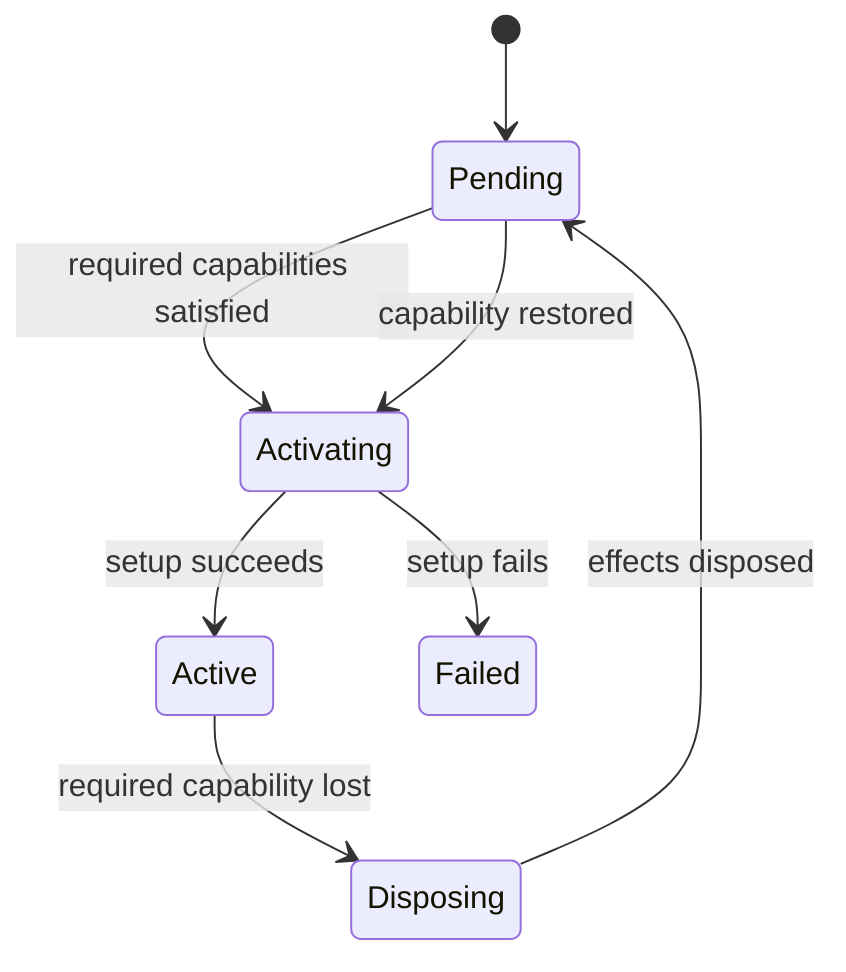

---

## 5.5 加载顺序不再是 Plugin 作者的责任

假设 KubeEye 先被加载：

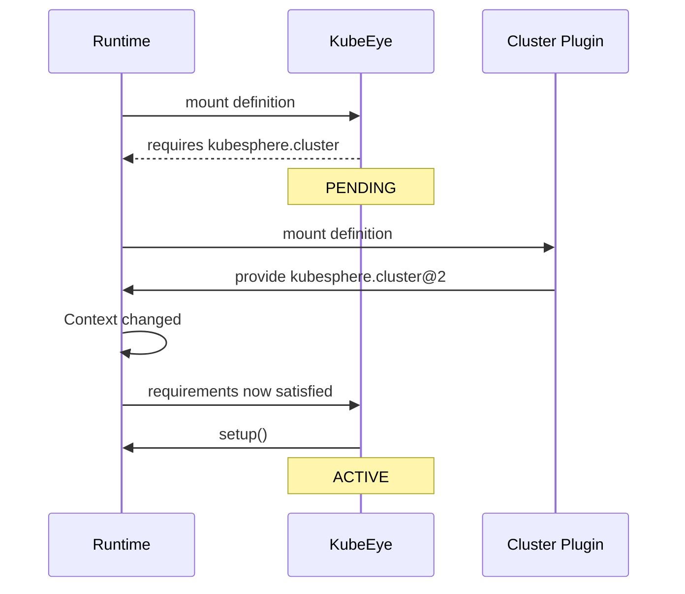

如果 Cluster Plugin 被卸载：

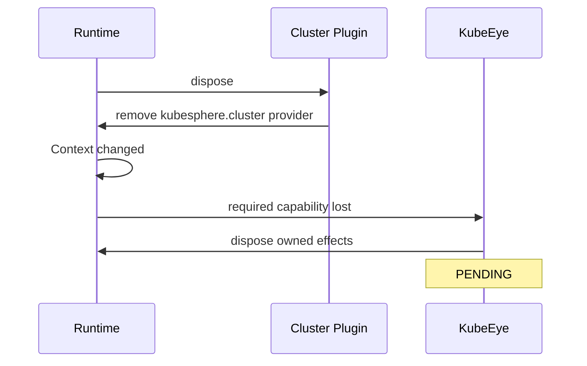

Cluster v2 重新出现：

```text
cluster v2 provide
    ↓
KubeEye requirements satisfied
    ↓
KubeEye re-activate
```

因此：

```text
KubeEye -> Cluster
```

不再意味着：

```text
Cluster 必须在配置文件里写在 KubeEye 前面
```

---

## 5.6 并发 Discovery / Load

Plugin artifact 可以并发加载：

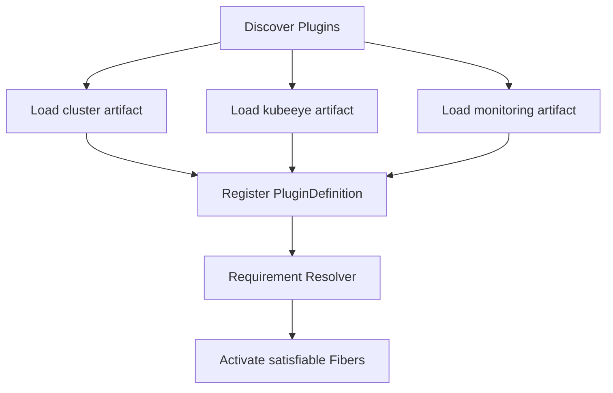

加载完成顺序不应该成为业务语义。

---

## 5.7 循环依赖

Reactive model 并不自动消灭循环依赖。

例如：

```text
A requires capability.b
B requires capability.a
```

如果二者只有激活后才提供对应 capability：

```text
A = PENDING
B = PENDING
```

会永久等待。

因此 Runtime 仍需：

- hard plugin dependency cycle detection
- wait-chain diagnostics
- permanent PENDING detection
- capability-provider graph inspection

诊断示例：

```text
Plugin A: PENDING
└── requires capability.b
    └── expected provider B
        └── B is PENDING
            └── requires capability.a
                └── expected provider A
```

---

# 6. Plugin Definition 与 API 形态

第一版 API 应保持小而稳定。

不要在 core 里提前加入：

```text
React
Router
MF
remoteEntry
DOM component
Redux Store
```

建议：

```ts
interface PluginDefinition<Config = unknown> {
  name: string;
  requires?: RequirementSpec;

  setup(
    ctx: PluginContext,
    config: Config,
  ): void | Promise<void>;
}

interface RequirementSpec {
  capabilities?: Record<string, string>;
  optionalCapabilities?: Record<string, string>;
  plugins?: Record<string, string>;
}
```

更友好的 SDK：

```ts
export default definePlugin({
  name: 'kubeeye',

  requires: {
    capabilities: {
      'kubesphere.cluster': '^2',
    },
  },

  setup(ctx) {
    // ...
  },
});
```

---

## 6.1 Definition、Manifest、Instance 必须分离

| 对象 | 作用 |
|---|---|
| `PluginDefinition` | 代码层插件契约：`name / requires / setup` |
| `PluginManifest` | 发布 / 发现元数据：version、compatibility、runtime entry、permissions 等 |
| `Fiber / PluginInstance` | 运行态实例：state、Context、Effects、diagnostics |

关系：

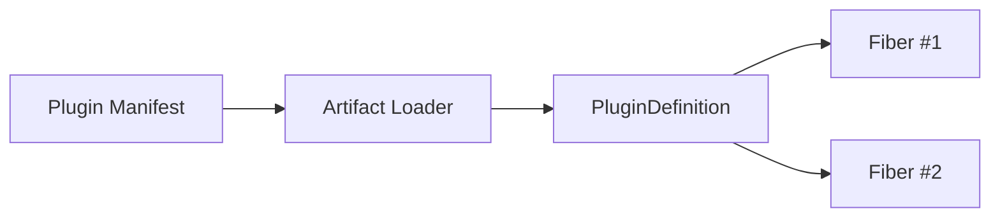

不要把它们合成一个巨大 `Plugin` 对象。

---

## 6.2 PluginDefinition 是 Runtime Truth 的一部分

代码真正调用：

```ts
ctx.services.provide(...)
ctx.extensions.register(...)
```

才是运行时发生的事实。

Manifest 的作用更多是：

- install-time validation
- compatibility check
- registry UI
- permission preview
- dependency preflight
- tooling / CI

这会在后面的 Manifest 章节进一步说明。

---

# 7. Extension System

## 7.1 Extension Point 可以理解为 Service + Effect

Extension Registry 可以由 builtin plugin 提供：

```ts
ctx.extensions.define(
  'workload.detail.tabs',
  {
    version: 2,
    schema: WorkloadTabExtensionSchema,
  },
);
```

KubeEye：

```ts
ctx.extensions.register(
  'workload.detail.tabs',
  {
    id: 'kubeeye',
    order: 200,
    component: KubeEyeTab,
  },
);
```

注册 contribution 本身是一个 Effect：

```text
register contribution
        ↓
owned by KubeEye Fiber
        ↓
KubeEye dispose
        ↓
contribution automatically removed
```

---

## 7.2 Contribution 不应该天然形成 Plugin Dependency

假设：

- KubeEye 向 `workload.detail.tabs` 注册
- Workload Plugin 在页面中消费这个 slot

不应该强制：

```text
KubeEye depends workload-plugin
```

而是：

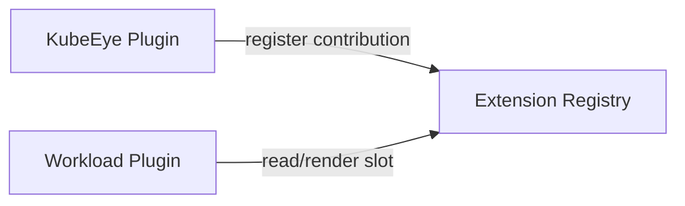

两个动作可以任意顺序发生。

### Contributor 先

```text
KubeEye ACTIVE
    ↓
Registry 保存 contribution
    ↓
Workload Plugin 后出现
    ↓
ExtensionSlot 读取 contribution
```

### Consumer 先

```text
Workload Plugin ACTIVE
    ↓
ExtensionSlot 当前为空
    ↓
KubeEye 后出现
    ↓
Registry changed
    ↓
ExtensionSlot 更新
```

最终状态一致。

---

## 7.3 建议的 Extension 类型

| 类别 | 示例 |
|---|---|
| Navigation | `global.navigation`、`cluster.navigation`、`workspace.navigation` |
| Route | `global.routes`、`cluster.routes`、`workspace.routes` |
| Page Slot | `dashboard.cards`、`workload.detail.tabs`、`cluster.overview.cards` |
| Action | `workload.detail.actions`、`table.row.actions`、`toolbar.actions` |
| Command | `command.palette`、`resource.commands` |
| Settings | `settings.sections`、`cluster.settings.tabs` |
| Header | `global.header.actions` |
| Detail | `resource.detail.sections` |

第一版建议只实现 2～3 个：

```text
navigation.items
workload.detail.tabs
dashboard.cards
```

先验证 Runtime 语义，不要先扩展数量。

---

## 7.4 Extension Contract 必须版本化

只有 key：

```text
workload.detail.tabs
```

是不够的。

Extension Point 是平台 ABI 的一部分，应至少包含：

```ts
interface ExtensionPointDefinition {
  key: string;
  version: number | string;
  schema?: unknown;
}
```

例如：

```text
workload.detail.tabs@2
```

安装 / 激活前可以发现：

```text
Plugin requires workload.detail.tabs@2
Current platform only provides workload.detail.tabs@1
```

而不是运行到 React render 才失败。

---

## 7.5 Extension 建议包含 owner metadata

Runtime 内部 contribution 应保留：

```ts
interface RuntimeExtensionRecord<T> {
  key: string;
  id: string;
  ownerFiberId: string;

  order?: number;
  value: T;
}
```

这样 diagnostics 可以回答：

```text
这个 Tab 是谁注册的？
这个按钮为什么存在？
这个 contribution 是否来自已失效 Plugin？
```

---

# 8. React 集成层

React 不进入 `plugin-runtime-core`。

建议拆层：

```text
packages/
├── plugin-runtime-core/   # no React
├── plugin-sdk/            # contracts
├── plugin-browser/        # DOM / Event / browser adapter
└── plugin-react/          # React bridge
```

---

## 8.1 ExtensionSlot

典型 API：

```tsx
<ExtensionSlot
  name="workload.detail.tabs"
  context={{
    cluster,
    namespace,
    kind,
    name,
  }}
/>
```

职责：

- 读取 Extension Registry；
- 过滤 `when(context)`；
- 按 order / priority 排序；
- 为 contribution 创建 Plugin Boundary；
- 把 owner Fiber 与 UI 错误关联；
- 在 Registry change 时更新；
- 做 Extension Contract runtime validation。

---

## 8.2 PluginBoundary

每个外部 contribution 不应该直接裸 render：

```tsx
<PluginBoundary
  pluginId={owner.pluginId}
  fiberId={owner.fiberId}
>
  <Contribution />
</PluginBoundary>
```

它可以处理：

- ErrorBoundary
- diagnostics
- plugin ownership
- telemetry
- fallback UI
- future circuit breaker

---

## 8.3 不把 Host React 内部状态作为 Plugin ABI

明确避免：

```text
Plugin -> Host Redux Store
Plugin -> Host Zustand Store
Plugin -> Host private React hook
Plugin -> Host internal Context tree
```

优先：

```text
Plugin -> Stable Service / Capability
```

例如：

```text
Theme
i18n
Permission
Cluster Context
API Client
Navigation
```

都通过稳定 contract 暴露。

---

## 8.4 React / ReactDOM 的 shared

如果 Trusted Plugin 都是 React：

```text
react
react-dom
```

可以作为平台级 shared dependency。

但不要进一步把大量业务依赖都 shared：

```text
lodash
swr
zustand
internal-ui-hooks
business-store
...
```

否则会出现：

```text
Plugin compatibility
≈
Host dependency compatibility
```

最终失去插件独立升级能力。

---

# 9. KS Console 自身插件化

Host 重新定义为：

```text
Bootstrap + Runtime Kernel + Shell Container
```

而不是业务意义上的 KS Console。

整体：

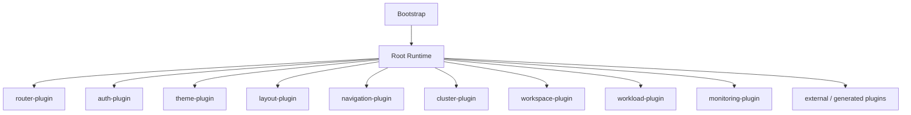

---

## 9.1 Builtin 与 External 的原则

| 维度 | Builtin Plugin | External Plugin |
|---|---|---|
| Plugin API | 同一套 | 同一套 |
| Lifecycle | Fiber / Effect | Fiber / Effect |
| Capability | provide / require | provide / require |
| Extension | 同一 Registry | 同一 Registry |
| 加载来源 | Local / bundled | MF / ESM / Registry |
| 信任等级 | trusted | trusted / verified / sandbox future |

> **验收原则**
>
> 如果 builtin plugin 大量依赖“仅内部可用”的特殊 API，而 external plugin 只能使用另一套模型，说明 Kernel 边界还没有抽干净。

---

## 9.2 哪些东西不应继续留在 Host 特权区

长期目标：

```text
Host 特权逻辑
      ↓
尽量缩减
```

例如：

```text
Navigation registry       -> navigation-plugin
Router registry           -> router-plugin
Theme                     -> theme-plugin
Cluster current context   -> cluster capability
Permissions               -> permission capability
Global commands           -> command plugin
```

这样 External Plugin 与 Builtin Plugin 才真正共享平台能力。

---

# 10. Artifact Loader：把 Module Federation 降级为实现细节

Runtime Kernel 只依赖：

```ts
interface PluginLoader {
  supports(manifest: PluginManifest): boolean;

  load(
    manifest: PluginManifest,
  ): Promise<PluginDefinition>;
}
```

实现：

```ts
class LocalPluginLoader
  implements PluginLoader {}

class EsmPluginLoader
  implements PluginLoader {}

class ModuleFederationPluginLoader
  implements PluginLoader {}

class IframePluginLoader
  implements PluginLoader {}
```

架构：

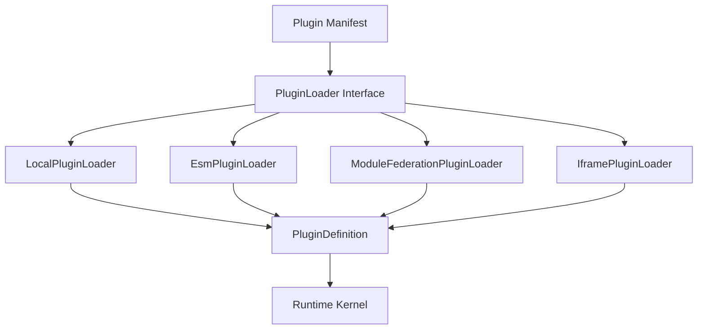

---

## 10.1 Module Federation 的定位

MF 负责：

> 把一个独立构建 Artifact 中的 JavaScript Module 加载进当前 Runtime。

MF 不负责：

- Plugin dependency semantics
- lifecycle
- capability
- Extension Point
- permission model
- rollback
- plugin ownership
- state transition
- compatibility policy

建议：

- 使用 Runtime API 动态注册 / 加载 remote；
- 不把 remotes 全部编译死到 Host；
- Manifest 只声明 `runtime.type = module-federation` 与 entry；
- `remoteEntry / shared / exposes / loadRemote` 不进入 Plugin SDK。

---

## 10.2 为什么 MF 不能成为 Plugin Protocol

如果协议写成：

```text
Plugin == remoteEntry.js
```

以后你很难支持：

```text
Local
Native ESM
iframe
Generated Plugin
Worker
Server-driven package
```

正确关系：

```text
Plugin Protocol
      ↓
PluginDefinition + Context Contract
      ↓
Artifact Loader
      ↓
MF / ESM / ...
```

而不是：

```text
MF
↓
再围绕 MF 反推 Plugin System
```

---

## 10.3 浏览器兼容策略

浏览器兼容性不是每个 Plugin 自己决定的。

平台统一维护：

```text
@kubesphere/browser-target
```

例如：

```json
{
  "browserslist": [
    "Chrome >= 100",
    "Edge >= 100",
    "Firefox >= 100",
    "Safari >= 15.4"
  ]
}
```

统一约束：

- JS target
- SWC target
- CSS target
- polyfill baseline
- Module Federation output
- ESM syntax baseline

否则可能出现：

```text
Host: ES2018
Plugin: ES2023

旧企业浏览器：
Host 可以打开
安装 Plugin 后 SyntaxError
```

策略建议：

- MF `script / var` remote 可作为保守默认；
- ESM remote 作为可选；
- 不允许 Plugin 绕过平台 target 随意输出 top-level await 等语法；
- Browser Baseline 属于 Plugin Platform contract。

---

# 11. Plugin Manifest

Manifest 不应第一天设计成巨大 Schema。

推荐先把 Runtime Kernel 跑通，然后根据真实需求反推 Manifest v1。

示例：

```json
{
  "schemaVersion": 1,
  "name": "kubeeye",
  "version": "2.0.0",

  "compatibility": {
    "kernel": "^1",
    "console": ">=5 <6"
  },

  "runtime": {
    "type": "module-federation",
    "entry": "https://example.com/kubeeye/mf-manifest.json"
  },

  "requires": {
    "capabilities": {
      "kubesphere.cluster": "^2"
    }
  },

  "permissions": [
    "cluster.read"
  ],

  "contributes": {
    "workload.detail.tabs": [
      "kubeeye"
    ]
  }
}
```

---

## 11.1 Manifest 的职责

Manifest 适合用于：

```text
Discovery
Install-time validation
Compatibility check
Registry display
Permission declaration
Artifact location
Dependency preflight
Static tooling / CI
Upgrade decision
```

但它不应成为 Runtime 真实行为的唯一来源。

---

## 11.2 Manifest 与 Runtime Truth

例如 Manifest 声明：

```json
{
  "requires": {
    "capabilities": {
      "kubesphere.cluster": "^2"
    }
  }
}
```

代码实际：

```ts
ctx.services.get('kubesphere.metrics');
```

如果二者不一致，会发生：

```text
安装前检查认为 OK
运行后却缺依赖
```

因此建议：

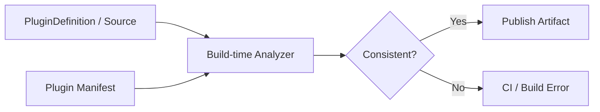

即：

> Manifest 用于静态声明；Runtime Context 操作是运行时事实；构建期负责校验二者不漂移。

---

## 11.3 Manifest 不要泄漏 Loader 内部细节

Manifest 可以：

```json
{
  "runtime": {
    "type": "module-federation",
    "entry": "..."
  }
}
```

但不要把平台核心模型设计成：

```json
{
  "remoteEntry": "...",
  "exposes": "...",
  "shared": ["..."],
  "webpackScope": "..."
}
```

这些是 MF adapter 的问题。

---

# 12. 信任与安全边界

MF / ESM Plugin 与 Host 在同一个 JavaScript Realm 中运行。

这意味着它原则上可能访问：

```text
window
document
localStorage
DOM
Host JS objects
```

所以：

> Module Federation 不是 security sandbox。

建议区分：

| 信任级别 | Runtime | 策略 |
|---|---|---|
| builtin | Local | 完整 SDK |
| official | Local / MF / ESM | trusted |
| verified third-party | MF / ESM + permission enforcement | 平台审核 |
| untrusted | sandboxed iframe + RPC SDK | 不直接访问 Host Realm |

---

## 12.1 Permission Declaration 不等于安全隔离

Manifest：

```json
{
  "permissions": [
    "cluster.read"
  ]
}
```

主要用于：

- capability gating
- UI
- API layer
- audit
- install warning

但 Trusted MF Plugin 依然运行于相同 Realm。

如果未来做真正第三方 Marketplace：

```text
Untrusted Plugin
      ↓
sandbox iframe
      ↓
RPC Transport
      ↓
Capability SDK
      ↓
Host
```

---

## 12.2 Direct SDK 与 RPC SDK 可以共享 Contract

未来可以：

```text
Plugin SDK Contract
├── Direct Transport
│   └── Trusted Plugin
└── RPC Transport
    └── Sandbox iframe
```

这样 Security Boundary 的变化不要求重新设计业务 Capability。

---

# 13. 插件开发体验

## 13.1 两种开发模式

| 模式 | 启动内容 | 用途 |
|---|---|---|
| Standalone Dev | Plugin + Lightweight Dev Host | 日常 UI / logic，完整 HMR |
| Integration Dev | Real KS Console + Plugin Dev Server | 真实 route / permission / API / theme / loader |

日常不应该要求：

```text
启动完整 Console
启动 Backend
启动 Cluster
再启动 Plugin
```

只是为了改一个 Tab 或 Button。

---

## 13.2 Dev Host 应成为 SDK 一等能力

建议：

```text
@kubesphere/plugin-dev-host
├── createMockPluginContext()
├── mock Service providers
├── ExtensionSlot playground
├── theme stub
├── i18n stub
├── permission stub
├── API mock
└── diagnostics panel
```

开发：

```bash
pnpm dev
```

默认：

```text
Plugin + Dev Host
```

集成：

```bash
pnpm dev:integration
```

再接真实 Host。

---

## 13.3 Dev Host 不应变成第二套 Runtime

非常重要：

```text
Dev Host
```

应该使用真实：

```text
plugin-runtime-core
plugin-react
plugin-browser
```

只是 provider 是 mock。

不能：

```text
Production Runtime 一套逻辑
Dev Harness 又模拟一套 lifecycle
```

否则开发环境与真实环境会漂移。

---

## 13.4 HMR 应复用 Plugin Lifecycle

理想 HMR：

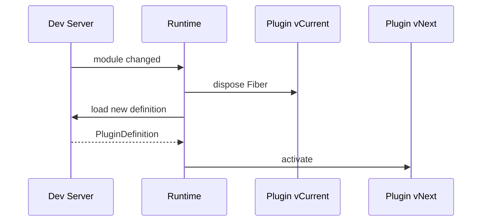

而不是为开发环境再造一套特殊热替换语义。

---

# 14. 发布、版本、升级与回滚

Plugin Artifact 应为 **immutable artifact**。

例如：

```text
kubeeye/
├── 2.0.0/
├── 2.0.1/
└── 2.1.0/
```

Runtime 保存的是：

```text
selected/current pointer -> immutable version
```

---

## 14.1 安装

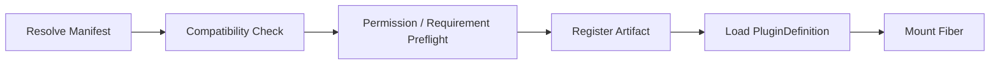

---

## 14.2 升级

升级不要直接覆盖旧版：

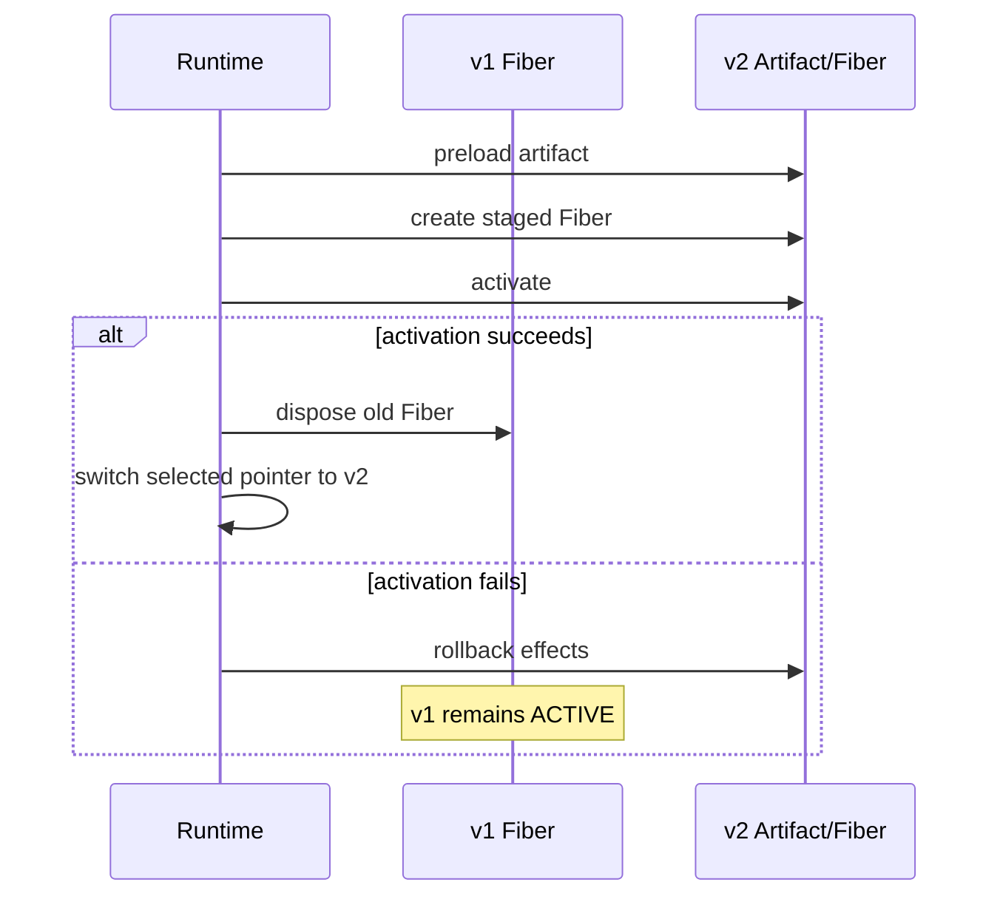

---

## 14.3 回滚

由于 artifact immutable：

```text
v3 -> v2
```

只需要：

```text
switch selected pointer
```

然后使用同一 lifecycle：

```text
dispose current Fiber
activate selected version
```

无需重新 build。

---

## 14.4 HMR、Upgrade、Rollback 应共享机制

这三者本质高度相似：

```text
Old Definition/Fiber
        ↓
dispose / stage
        ↓
New Definition
        ↓
activate
        ↓
success commit / failure rollback
```

不要为 HMR、Upgrade、Rollback 各设计一套 lifecycle。

---

# 15. Runtime 诊断与可观测性

动态 Plugin Runtime 没有 diagnostics 会迅速变成黑盒。

第一版就建议加入：

```ts
runtime.inspect();
runtime.listFibers();
runtime.listServices();
runtime.listExtensions();
runtime.explainPending(pluginId);
runtime.explainOwner(resourceId);
```

---

## 15.1 Fiber Diagnostics

至少包含：

```text
fiber id
plugin id/name/version
state
parent
scope
activation error
effect count
created time
last transition
```

示例：

```text
Plugin: kubeeye
Fiber: kubeeye#14
State: ACTIVE

Requirements:
✓ kubesphere.cluster@2 -> cluster#3

Effects:
- extension workload.detail.tabs/kubeeye
- event cluster.changed
- route /kubeeye
```

---

## 15.2 Pending Diagnostics

```text
Plugin: kubeeye
State: PENDING

Missing:
- kubesphere.cluster >= 2

Optional Missing:
- kubesphere.metrics >= 1

Owned Effects:
- none
```

对于等待链：

```text
kubeeye
└── requires cluster
    └── no provider
```

或者：

```text
A
└── requires capability.b
    └── B PENDING
        └── requires capability.a
            └── A PENDING
```

---

## 15.3 Runtime 至少应可查看的对象

| 对象 | 信息 |
|---|---|
| Fiber | id、plugin、state、parent、error、effect count |
| Requirement | key、range、provider、未满足原因 |
| Service | key、version、provider Fiber、scope |
| Extension | slot key、contribution id、owner Fiber、order |
| Loader | manifest、runtime type、load state、artifact source |
| Effect | type、owner、description、created order |
| Context | scope、visible services、parent |

---

# 16. 推荐代码结构

建议：

```text
packages/
├── plugin-runtime-core/
│   ├── effect-scope.ts
│   ├── fiber.ts
│   ├── context.ts
│   ├── runtime.ts
│   ├── plugin-registry.ts
│   ├── service-registry.ts
│   ├── requirement-resolver.ts
│   ├── lifecycle.ts
│   ├── diagnostics.ts
│   └── errors.ts
│
├── plugin-sdk/
│   ├── plugin.ts
│   ├── define-plugin.ts
│   ├── manifest.ts
│   ├── capability.ts
│   ├── requirement.ts
│   └── extension.ts
│
├── plugin-browser/
│   ├── browser-context.ts
│   ├── event-service.ts
│   ├── dom-effect.ts
│   └── browser-services.ts
│
├── plugin-react/
│   ├── ExtensionSlot.tsx
│   ├── PluginBoundary.tsx
│   ├── PluginProvider.tsx
│   └── ReactExtensionService.ts
│
├── plugin-loader-local/
├── plugin-loader-esm/
├── plugin-loader-mf/
├── plugin-loader-iframe/       # future
│
├── plugin-dev-host/
│   ├── mock-context.ts
│   ├── mock-services.ts
│   └── diagnostics-ui/
│
└── playground/
    ├── core-plugin.ts
    ├── cluster-plugin.ts
    ├── workload-plugin.ts
    └── kubeeye-plugin.ts
```

依赖方向：

```mermaid
flowchart TD
    Core["plugin-runtime-core"]
    SDK["plugin-sdk"]
    Browser["plugin-browser"]
    React["plugin-react"]
    Local["plugin-loader-local"]
    ESM["plugin-loader-esm"]
    MF["plugin-loader-mf"]
    Dev["plugin-dev-host"]

    SDK --> Core
    Browser --> Core
    React --> SDK
    React --> Browser

    Local --> Core
    ESM --> Core
    MF --> Core

    Dev --> React
```

需要避免依赖反转成：

```text
runtime-core -> React
runtime-core -> MF
runtime-core -> KS Console
```

---

# 17. 分步实施规划

下面顺序是 **架构依赖顺序**，不是日历排期。

原则：

> 前一层生命周期语义未稳定前，不把下一层的复杂度提前引入。

---

## 阶段 0：建立约束与 ADR

先形成 Architecture Decision Records：

### ADR-001：Everything is Plugin

```text
Host = Bootstrap + Kernel + Shell
KS Console 业务模块 = Builtin Plugins
```

### ADR-002：Kernel 无 React / MF / KS Business

Kernel 只处理通用 Runtime semantics。

### ADR-003：所有 mutation 必须有 owner

所有可追踪 mutation 应通过 Context，并绑定 Fiber / EffectScope。

### ADR-004：Effect LIFO + idempotent

Fiber dispose 必须可重复调用，不重复 cleanup。

### ADR-005：Capability 优先于 Plugin Dependency

跨 Plugin 能力通过 Contract 交互。

### ADR-006：Contribution 不制造加载顺序

Extension Registry 解耦 contributor 与 consumer。

### ADR-007：MF 只是 Loader

Module Federation 不进入 Plugin ABI。

---

## 阶段 1：EffectScope + Fiber

> **第一行代码从这里开始。**

实现：

```text
EffectScope.add(disposer)
EffectScope.child()
EffectScope.dispose()

Fiber.state
Fiber.activate()
Fiber.dispose()
```

必须处理：

- LIFO
- idempotency
- async disposer
- disposer failure
- setup rollback
- parent → child cascade
- Fiber isolation

### 阶段 1 验收

无需浏览器。

只使用 unit test：

```text
✓ dispose effects in reverse order
✓ rollback effects when activation fails
✓ dispose is idempotent
✓ disposing parent disposes child scopes
✓ one Fiber cannot dispose another Fiber's effects
```

---

## 阶段 2：Context 与当前 Fiber

实现：

```text
Root Context
Child Context
Current Fiber ownership
ctx.effect()
```

然后增加第一个自动 Effect API：

```ts
ctx.events.on(...)
```

验证：

```text
plugin setup
    ↓
ctx.events.on()
    ↓
listener automatically owned by current Fiber
    ↓
Fiber dispose
    ↓
listener removed
```

这一阶段仍然不接 React / MF。

---

## 阶段 3：Service Registry + Capability

实现：

```text
provide(key, version, value)
remove provider
lookup
watch
scope visibility
```

其中：

```text
provide
```

本身必须是 Effect。

需要决策：

- 同 key 单 provider？
- multi binding？
- priority？
- scope isolation？

第一版建议先采用简单、可预测策略。

加入 SemVer matching：

```text
requires ^2
provider 2.1.0
=> satisfied
```

---

## 阶段 4：Reactive Coeffect / Requirement Resolver

实现：

```text
required capabilities
optional capabilities
PENDING
ACTIVE
dependency lost
dependency restored
```

优化：

> Context change 时只重新评估真正受影响的 Fiber，而不是扫描所有 Plugin。

例如建立：

```text
capability key
    ↓
waiting Fiber index
```

### 阶段 4 核心 POC

```mermaid
sequenceDiagram
    participant R as Runtime
    participant K as KubeEye
    participant C as Cluster

    R->>K: mount
    Note over K: PENDING

    R->>C: mount
    C->>R: provide cluster
    R->>K: activate
    Note over K: ACTIVE

    R->>C: unmount
    C->>R: remove cluster
    R->>K: dispose effects
    Note over K: PENDING

    R->>C: mount cluster v2
    C->>R: provide cluster
    R->>K: re-activate
    Note over K: ACTIVE
```

---

## 阶段 5：Plugin Composition 与 Builtin Plugins

实现：

```text
mount/unmount PluginDefinition
child plugin
group scope
plugin registry
```

建立四个纯逻辑 Demo：

```text
core-plugin
cluster-plugin
workload-plugin
kubeeye-plugin
```

验证：

```text
任意 discovery 顺序
        ↓
最终 Runtime 状态一致
```

此阶段依然可以没有 UI。

---

## 阶段 6：Extension Registry

先实现：

```text
navigation.items
workload.detail.tabs
dashboard.cards
```

要求：

- contribution 自动绑定 Fiber；
- contract version；
- schema validation；
- owner diagnostics；
- contributor / consumer 顺序无关。

---

## 阶段 7：React / Browser Integration

实现：

```text
ExtensionSlot
PluginBoundary
Router Service
Navigation Service
Theme Service
i18n Service
Permission Service
API Client Service
```

选一个现有 KS 小模块作为第一个 Builtin Plugin。

优先候选：

```text
Navigation
```

或者：

```text
一个独立 Overview 区域
```

目标：

> 验证 Builtin 与 External 使用同一套 Lifecycle / Capability / Extension API。

---

## 阶段 8：Manifest + Loader 抽象

从已稳定的 Runtime 反推 Manifest v1。

顺序：

```text
LocalPluginLoader
        ↓
EsmPluginLoader
        ↓
ModuleFederationPluginLoader
```

这样可以证明：

> Runtime semantics 不依赖 MF。

同时实现：

```text
Manifest <-> PluginDefinition consistency check
```

---

## 阶段 9：动态安装、升级、回滚、HMR

实现：

- immutable version artifact；
- selected pointer；
- preload；
- staged activation；
- activation failure rollback；
- version switch；
- HMR lifecycle reuse；
- health signal；
- diagnostics。

关键要求：

```text
v2 activate fail
    ↓
v2 effects fully rollback
    ↓
v1 remains ACTIVE
```

---

## 阶段 10：Developer Platform

实现：

```text
Plugin Dev Host
createMockPluginContext()
plugin scaffold
standard browser target
manifest validator
compatibility checker
runtime diagnostics panel
integration test harness
compatibility CI
```

---

# 18. 第一版 POC 验收矩阵

| 场景 | 操作 | 预期 |
|---|---|---|
| Effect LIFO | A effect → B effect → dispose | B inverse 先于 A |
| 激活失败 | 两个 Effect 后 throw | Effects 全撤销，Fiber=FAILED |
| 幂等销毁 | dispose 两次 | 第二次无重复 cleanup |
| 父子 Scope | parent dispose | child first / all disposed |
| Plugin 隔离 | dispose A | B 的 Effects 不受影响 |
| 依赖后到 | kubeeye 后 cluster | PENDING → ACTIVE |
| 依赖消失 | unload cluster | kubeeye → PENDING |
| 依赖恢复 | cluster v2 mount | kubeeye 自动 ACTIVE |
| Service ownership | provider Fiber dispose | Service 自动消失 |
| Contribution 先到 | contributor 先注册 | consumer 出现后可读 |
| Consumer 先到 | slot 先渲染 | contribution 后到自动出现 |
| 升级失败 | v2 setup throw | v1 保持 ACTIVE |
| Manifest mismatch | 声明与 code 不同 | Build / CI fail |

---

# 19. KS Console 渐进迁移策略

不建议一次性重写 Host。

采用：

```text
New Runtime + Existing Console coexist
```

逐步迁移。

---

## 19.1 Step 1：引入 Runtime Kernel

现有页面结构先不改变：

```text
Existing KS Console
     +
New Plugin Runtime
```

先让 Runtime 作为新基础设施存在。

---

## 19.2 Step 2：迁移一个 Extension Registry

优先：

```text
Navigation
```

或者一个简单区域：

```text
Overview Cards
```

把原来：

```text
global registry / static route
```

变成：

```text
Extension Service
```

---

## 19.3 Step 3：迁移一个低耦合 Builtin Plugin

验证：

```text
mount
route contribution
navigation contribution
effect ownership
dispose
```

---

## 19.4 Step 4：公共能力 Capability 化

逐渐将：

```text
permission
cluster context
i18n
API client
theme
navigation
```

包装成 stable capability。

---

## 19.5 Step 5：新 Plugin 优先走新 API

新插件：

```text
New Plugin SDK
```

旧插件：

```text
Compatibility Adapter
```

不要反过来为了旧 API 破坏新 Kernel。

---

## 19.6 Step 6：进一步插件化 Shell

当：

```text
router
navigation
cluster
workspace
workload
...
```

逐步 plugin 化后，再把：

```text
layout / shell
```

从特殊 Host 逻辑继续下沉。

---

## 19.7 Step 7：旧插件 API Deprecated

最终避免长期维护：

```text
Old Plugin Philosophy
+
New Plugin Philosophy
```

两套系统。

Compatibility layer 应明确有结束边界。

---

# 20. 明确禁止 / 尽量避免的设计

以下设计应作为 Architecture Guardrail。

### 不要把 MF 当插件协议

```text
❌ remoteEntry.js = Plugin
❌ mf-manifest.json = Plugin Protocol
```

### 不要直接依赖另一个 Plugin 内部实现

```ts
// ❌
import { ClusterStore } from '@plugins/cluster/internal';
```

应该：

```ts
// ✅
ctx.services.get('kubesphere.cluster');
```

### 不要把 Host Store 当 ABI

```text
❌ Redux Store
❌ Zustand Store
❌ Host private hooks
```

### 不要依赖手工 unregister

```text
❌ 每个 Plugin 自己记 route/menu/listener cleanup
```

Runtime 必须自动追踪常见 Effect。

### 不要用配置顺序表达依赖

```text
❌ Plugin A 必须写在 Plugin B 前面
```

### Contribution 不要因为 Slot 而强依赖某具体 Plugin

```text
❌ KubeEye depends workload-plugin
```

只是因为它贡献一个 workload tab。

### 不要把一切都 MF shared

否则：

```text
shared dependency version
        ↓
决定 Plugin compatibility
```

### 不要默认 iframe / Shadow DOM

按需求选：

```text
Trusted same-framework -> normal DOM
Cross-framework widget -> Web Component if needed
Untrusted -> iframe
```

### 不要一开始设计几十个 Extension Point

先稳定：

```text
Fiber / Effect / Coeffect / Context
```

再扩展平台表面。

---

# 21. 关键架构决策清单

| 决策 | 结论 |
|---|---|
| Host 定义 | Host = Bootstrap + Kernel + Shell；KS Console 业务也是 builtin plugin |
| 核心 Runtime 单元 | Fiber，不是 React Component / Remote Module |
| 副作用模型 | Effect 必须可撤销，归属 Fiber，LIFO dispose |
| 依赖模型 | Reactive Capability Requirements |
| Plugin hard dependency | 支持，但少用 |
| Extension | Extension Service + Revertible Registration Effect |
| Dynamic Loader | Loader abstraction |
| MF 定位 | Artifact transport / runtime，不是 Plugin System |
| React 定位 | Integration layer，不进入 Kernel |
| Dev 模式 | Standalone Dev Host 优先 |
| Browser target | Platform unified target |
| 版本 | Immutable Artifact + selected pointer |
| 升级 | Staged activation + rollback |
| 安全 | Trusted 同 Realm；Untrusted iframe/RPC |
| Manifest | Static metadata，不替代 runtime truth |
| Diagnostics | Kernel 一等能力 |

---

# 22. 仍需单独决策的问题

这些问题不要在第一阶段随便写死，应通过 ADR 单独决策。

## 22.1 Service 同 Key 多 Provider

选择：

```text
single provider
priority provider
multi-binding
scope isolation
```

需要结合具体能力类型。

---

## 22.2 Capability Version

采用：

```text
SemVer
```

还是：

```text
Platform Contract Version
```

或者：

```text
SemVer + schema version
```

需要进一步决定。

---

## 22.3 Optional Capability 动态变化

例如 metrics 后加载：

方案 A：

```text
重启整个 Plugin Fiber
```

方案 B：

```text
只重建 Metrics child scope
```

长期更倾向 B，但第一版可以先用简单模型。

---

## 22.4 React Sharing Strategy

是否强制：

```text
react
react-dom
```

由平台共享？

Design System：

```text
shared runtime dependency
```

还是：

```text
stable SDK / Web Component / CSS token
```

需要单独验证升级策略。

---

## 22.5 Permission 与后端授权

Manifest permission 如何映射：

```text
K8s RBAC
KubeSphere RBAC
ABAC
Backend API Authorization
```

前端声明只能是 UX / capability enforcement 的一部分，不能替代后端安全。

---

## 22.6 Plugin Config Reconcile

配置变化时：

方案 A：

```text
dispose old Fiber
activate new Fiber
```

方案 B：

```text
Plugin reconcile(config)
```

第一版建议 A，成熟后再考虑 B。

---

## 22.7 Multi-instance Scope

同一个 Plugin 在：

```text
cluster-a
cluster-b
workspace-a
workspace-b
```

如何拥有不同 Context / Fiber？

这会直接影响：

```text
scope
service visibility
extension visibility
routing
cache
```

需要在 Fiber/Context 基础稳定后设计。

---

## 22.8 Legacy Plugin Compatibility

旧 KS Plugin API：

```text
compatibility adapter
```

需要明确：

- 支持哪些能力；
- 哪些旧行为无法可靠映射到 Effect；
- adapter 维护多久；
- 什么版本停止兼容。

---

# 23. 第一项实际开发任务

如果今天创建仓库，第一批文件建议只有：

```text
plugin-runtime-core/
├── effect-scope.ts
├── fiber.ts
├── errors.ts
└── __tests__/
    ├── effect-scope.test.ts
    └── fiber.test.ts
```

暂时不要创建：

```text
PluginManager
ModuleFederationLoader
ReactExtensionSlot
ManifestResolver
RouterPlugin
```

---

## 23.1 EffectScope 第一版 Contract

```ts
export type Disposer =
  () => void | Promise<void>;

export class EffectScope {
  add(disposer: Disposer): void;

  child(): EffectScope;

  dispose(): Promise<void>;
}
```

语义必须明确：

```text
1. disposer 按 LIFO
2. dispose 幂等
3. child 在 parent 完成前被清理
4. 一个 disposer 抛错不能让剩余资源全部泄漏
5. dispose 完成后 scope 不再接受新 Effect
```

---

## 23.2 Fiber 第一版 Contract

```ts
export type FiberState =
  | 'created'
  | 'pending'
  | 'activating'
  | 'active'
  | 'disposing'
  | 'disposed'
  | 'failed';

export class Fiber extends EffectScope {
  readonly id: string;
  state: FiberState;

  activate(): Promise<void>;
  dispose(): Promise<void>;
}
```

第一批必须通过：

```text
✓ dispose effects in reverse order
✓ rollback effects when activation fails
✓ dispose is idempotent
✓ disposing parent disposes child scopes
✓ one Fiber cannot dispose another Fiber's effects
```

---

## 23.3 第一版不要实现 Service

直到 Effect / Fiber semantics 稳定后：

```text
EffectScope
    ↓
Fiber
    ↓
Context
    ↓
Service Registry
    ↓
Reactive Coeffect
```

这个顺序不要反过来。

---

## 23.4 第一版 Runtime POC 的终极验收

最终在没有 React / MF 的情况下跑：

```mermaid
sequenceDiagram
    participant R as Runtime
    participant K as KubeEye
    participant C as Cluster

    R->>K: mount kubeeye
    Note over K: PENDING

    R->>C: mount cluster
    C->>R: provide kubesphere.cluster

    R->>K: activate
    Note over K: ACTIVE

    R->>C: unmount cluster
    C->>R: remove provider

    R->>K: dispose owned effects
    Note over K: PENDING

    R->>C: mount cluster v2
    C->>R: provide kubesphere.cluster

    R->>K: activate again
    Note over K: ACTIVE

    R->>K: explicit unmount
    Note over K: DISPOSED
```

如果这条链能稳定工作：

> KS 新 Plugin Runtime 的核心已经成立。

后续 React、ExtensionSlot、MF、Manifest 都是建立在这套生命周期语义之上的能力层。

---

# 24. 参考资料

本方案主要参考以下公开思想与生态能力，但不代表直接采用对应实现。

1. **A Programming Paradigm for Spatiotemporal Composability**  
   Cordiverse / DeepSeek-related preprint，2026 Draft  
   <https://github.com/cordiverse/paper>

2. **DeepSeek Harness — Everything is a Plugin**  
   <https://github.com/deepseek-ai/deepseek-harness>

3. **DeepSeek Harness / Cordis Tutorial & Documentation**  
   Service dependency、plugin lifecycle、composition 等参考  
   <https://github.com/deepseek-ai/deepseek-harness/tree/master/docs>

4. **Module Federation Documentation**  
   Runtime Loading、Manifest、Build Tool Integration  
   <https://module-federation.io/>

---

# 25. 最终结论

如果从零重新开发 KS Console 插件系统，最值得优先投资的不是 Module Federation，而是一个**小而可靠的自研 Runtime Kernel**。

核心链路是：

```mermaid
flowchart TD
    EffectScope["EffectScope<br/>副作用所有权"]
    Fiber["Fiber<br/>运行时实例 / 生命周期"]
    Context["Context<br/>受控世界视图"]
    Effect["Revertible Effect<br/>可撤销变化"]
    Coeffect["Reactive Coeffect<br/>动态依赖"]
    Capability["Service / Capability"]
    Extension["Extension System"]
    React["React / Browser Integration"]
    Loader["Artifact Loader"]
    MF["MF / ESM / iframe"]
    Plugins["Builtin / External / Generated Plugins"]

    EffectScope --> Fiber
    Fiber --> Context
    Context --> Effect
    Context --> Coeffect
    Coeffect --> Capability

    Capability --> Extension
    Extension --> React

    Loader --> MF
    MF --> Plugins
    Plugins --> Fiber
```

这套架构的重点不是：

```text
“把 KS Console 拆成很多 remote”
```

而是：

```text
让每个模块都成为一个
可组合
可追踪
可撤销
可暂停
可恢复
可升级
可诊断
的 Runtime Component
```

因此：

```text
Manifest            -> 发布与静态声明
Artifact Loader      -> 把 Artifact 变成 PluginDefinition
Module Federation    -> Loader 的一个实现
PluginDefinition     -> 代码契约
Fiber                -> Runtime Instance
Context              -> 受控交互边界
Effect               -> 时间维度上的可撤销变化
Coeffect / Capability-> 空间维度上的动态组合
Extension            -> Console 产品能力开放方式
```

最终才能真正实现：

> **Everything is Plugin**

而不是仅仅实现：

> **Everything is dynamically imported JavaScript**。
